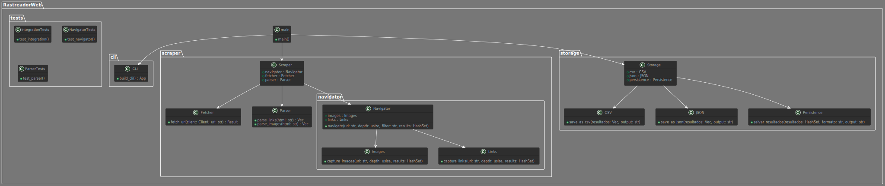

# RastreadorWeb


---

**RastreadorWeb** é uma ferramenta poderosa e de alto desempenho para scraping da web, construída com Rust. Explore, capture e armazene dados de websites com facilidade e eficiência.

---


## Índice

1. [🚀 Funcionalidades](#-funcionalidades)
2. [📦 Instalação](#-instalação)
   - [Pré-requisitos](#pré-requisitos)
   - [Passos](#passos)
3. [🔧 Configuração](#-configuração)
   - [Parâmetros da CLI](#parâmetros-da-cli)
4. [🛠️ Uso](#️-uso)
   - [Comandos Básicos](#comandos-básicos)
5. [📁 Armazenamento de Dados](#-armazenamento-de-dados)
   - [Formatos de Saída](#formatos-de-saída)
6. [💡 Boas Práticas](#-boas-práticas)
7. [🤝 Contribuições](#-contribuições)
8. [📄 Licença](#-licença)
9. [📞 Suporte](#-suporte)
10. [📊 Visão Geral Executiva](#visão-geral-executiva)
    - [O que é o RastreadorWeb?](#o-que-é-o-rastreadorweb)
    - [Principais Funcionalidades](#principais-funcionalidades)
    - [Casos de Uso](#casos-de-uso)
    - [Benefícios para a Empresa](#benefícios-para-a-empresa)
11. [🔍 Visão Geral Técnica](#visão-geral-técnica)
    - [Arquitetura e Tecnologias Utilizadas](#arquitetura-e-tecnologias-utilizadas)
    - [Componentes Principais](#componentes-principais)
    - [Fluxo de Operação](#fluxo-de-operação)
    - [Destaques Técnicos](#destaques-técnicos)
12. [📘 Manual de Uso do RastreadorWeb](#manual-de-uso-do-rastreadorweb)
    - [Introdução](#introdução)
    - [Instalação](#instalação)
      - [Pré-requisitos](#pré-requisitos-1)
      - [Passos de Instalação](#passos-de-instalação)
    - [Configuração](#configuração-1)
      - [Configuração da CLI](#configuração-da-cli)
      - [Parâmetros Principais](#parâmetros-principais)
    - [Uso](#uso-1)
      - [Comandos Básicos](#comandos-básicos-1)
      - [Exemplos de Uso](#exemplos-de-uso)
    - [Armazenamento de Dados](#armazenamento-de-dados-1)
      - [Formatos de Saída](#formatos-de-saída-1)
      - [Exemplo de Arquivo CSV](#exemplo-de-arquivo-csv)
      - [Exemplo de Arquivo JSON](#exemplo-de-arquivo-json)
    - [Boas Práticas](#boas-práticas-1)
    - [Suporte e Contribuição](#suporte-e-contribuição)


---

## 🚀 Funcionalidades

- **Navegação Profunda**: Capacidade de rastrear múltiplos níveis de profundidade em um site.
- **Filtragem Avançada**: Filtre e capture apenas os dados que você precisa - imagens ou links.
- **Armazenamento Flexível**: Salve os dados extraídos em formatos CSV ou JSON.
- **Concorrência Assíncrona**: Utilize o poder do Rust para realizar múltiplas requisições simultaneamente.

---

## 📦 Instalação

### Pré-requisitos

- [Rust](https://www.rust-lang.org/tools/install) instalado em sua máquina.

### Passos

1. **Clone o Repositório:**
   ```sh
   git clone https://github.com/seu-usuario/rastreadorweb.git
   cd rastreadorweb
   ```

2. **Compile o Projeto:**
   ```sh
   cargo build --release
   ```

3. **Execute os Testes (Opcional):**
   ```sh
   cargo test
   ```

---

## 🔧 Configuração

### Parâmetros da CLI

- `url`: A URL inicial para o rastreamento. (Obrigatório)
- `--profundidade` ou `-p`: Define a profundidade do rastreamento. (Padrão: 1)
- `--filtro` ou `-f`: Define o tipo de dados a serem filtrados (`imagens` ou `links`). (Padrão: `links`)
- `--formato` ou `-F`: Define o formato do arquivo de saída (`csv` ou `json`). (Padrão: `json`)
- `--output` ou `-o`: Define o nome do arquivo de saída. (Padrão: `output.json`)

---

## 🛠️ Uso

### Comandos Básicos

1. **Rastrear um Site:**
   ```sh
   ./target/release/rastreadorweb https://www.exemplo.com --profundidade 2 --filtro links --formato csv --output links.csv
   ```

2. **Rastrear Imagens com Profundidade 3:**
   ```sh
   ./target/release/rastreadorweb https://www.exemplo.com --profundidade 3 --filtro imagens --formato json --output imagens.json
   ```

3. **Rastrear Links com Configurações Padrão:**
   ```sh
   ./target/release/rastreadorweb https://www.exemplo.com
   ```

---

## 📁 Armazenamento de Dados

**Formatos de Saída:**

- **CSV:**
  ```csv
  http://exemplo.com/link1
  http://exemplo.com/link2
  http://exemplo.com/link3
  ```

- **JSON:**
  ```json
  [
      "http://exemplo.com/imagem1.jpg",
      "http://exemplo.com/imagem2.jpg",
      "http://exemplo.com/imagem3.jpg"
  ]
  ```

---

## 💡 Boas Práticas

1. **Verificar Robots.txt:** 
   Verifique se o site permite a extração de dados consultando o arquivo `robots.txt` do site.
   
2. **Respeitar a Privacidade e os Termos de Serviço:**
   Certifique-se de estar em conformidade com os termos de serviço do site e com as leis de privacidade de dados aplicáveis.
   
3. **Usar de Forma Ética:**
   Evite sobrecarregar os servidores de um site com múltiplas requisições simultâneas e use limites de taxa se necessário.

---

## 🤝 Contribuições

Contribuições são bem-vindas! Siga os passos abaixo para contribuir:

1. Faça um fork do projeto.
2. Crie uma nova branch para sua feature ou correção: `git checkout -b minha-feature`.
3. Commit suas mudanças: `git commit -m 'Adiciona minha nova feature'`.
4. Faça push para a branch: `git push origin minha-feature`.
5. Envie um pull request.

---

## 📄 Licença

Este projeto está licenciado sob a licença MIT - veja o arquivo [LICENSE](LICENSE) para mais detalhes.

---

## 📞 Suporte

Para suporte adicional, abra uma issue no repositório ou entre em contato com os mantenedores.

---

## Visão Geral Executiva

***O que é o RastreadorWeb?***

O RastreadorWeb é uma ferramenta avançada de scraping da web, projetada para explorar e extrair informações de sites de forma eficiente e automatizada. Este software é capaz de navegar por páginas da web, capturar dados específicos como imagens e links, e armazenar esses dados em diferentes formatos para posterior análise e utilização.

### **Principais Funcionalidades**

**Navegação Profunda:**

O RastreadorWeb pode navegar por múltiplos níveis de profundidade em um site, permitindo a captura de informações não apenas da página inicial, mas também de páginas vinculadas.

**Filtragem Avançada:**

Os usuários podem especificar filtros para direcionar o scraping. Por exemplo, é possível configurar o software para capturar apenas imagens ou links específicos dentro de um site.

**Armazenamento Flexível:**

Os dados extraídos podem ser armazenados em formatos CSV ou JSON, oferecendo flexibilidade para integrações com outras ferramentas de análise de dados e relatórios.

**Desempenho e Escalabilidade:**

Construído com a linguagem de programação Rust, conhecida por sua alta performance e segurança, o RastreadorWeb é capaz de realizar operações complexas de scraping de maneira rápida e eficiente.
Casos de Uso

**Monitoramento de Concorrência:**

Empresas podem usar o RastreadorWeb para monitorar sites de concorrentes, coletando dados sobre produtos, preços e promoções.

**Análise de Mercado:**

Analistas podem extrair grandes volumes de dados da web para identificar tendências de mercado, comportamentos de consumidores e oportunidades de negócio.

**Gestão de Conteúdo:**

Plataformas de mídia e publicações podem usar a ferramenta para agregar conteúdo de diversas fontes, facilitando a curadoria e publicação de informações.
Benefícios para a Empresa

**Tomada de Decisão Informada:**

Ao fornecer dados atualizados e detalhados, o RastreadorWeb capacita os tomadores de decisão com insights valiosos que podem influenciar estratégias de negócios.

**Eficiência Operacional:**

Automatizando o processo de coleta de dados, a ferramenta reduz a necessidade de esforços manuais, economizando tempo e recursos.

**Adaptabilidade:**

Com a capacidade de personalizar filtros e profundidade de navegação, o RastreadorWeb pode ser ajustado para atender a diferentes necessidades e objetivos de negócio.

---

## Visão Geral Técnica

 ***Arquitetura e Tecnologias Utilizadas***

O RastreadorWeb é desenvolvido em Rust, uma linguagem de programação conhecida por sua segurança de memória, alto desempenho e concorrência eficiente. A arquitetura do projeto é modular e segue os princípios de SOLID e Clean Code, facilitando a manutenção e a escalabilidade do software.



### **Componentes Principais**

**CLI (Interface de Linha de Comando):**

Utiliza a biblioteca clap para construir uma interface de linha de comando intuitiva e flexível, permitindo que os usuários configurem parâmetros como URL inicial, profundidade de navegação, filtros de dados e formatos de saída.

**Scraper:**

> ***Navigator:*** Responsável por navegar pelas páginas da web, capturando imagens e links conforme especificado pelos filtros do usuário. Implementa funções assíncronas utilizando reqwest e futures para realizar múltiplas requisições simultâneas.
Fetcher: Realiza a busca das URLs, retornando o conteúdo HTML das páginas.
Parser: Utiliza a biblioteca scraper para extrair links e imagens do HTML das páginas visitadas.
Storage:

> ***CSV e JSON:*** Implementa funções para salvar os dados extraídos em arquivos CSV e JSON. Utiliza a biblioteca serde_json para serialização de dados JSON e manipula arquivos com funções de E/S robustas.
Persistence: Centraliza a lógica de persistência de dados, delegando o salvamento para os módulos CSV e JSON conforme a configuração do usuário.

**Testes:**

Testes de integração e unitários são utilizados para garantir que todos os componentes funcionem corretamente e de forma integrada. Utiliza bibliotecas de teste padrão do Rust.
Fluxo de Operação

**Inicialização:**

A aplicação é inicializada a partir do módulo principal (main.rs), onde a CLI é configurada e os parâmetros do usuário são capturados.

**Navegação e Extração:**

Baseado nos parâmetros, o Navigator inicia a navegação a partir da URL fornecida, utilizando Fetcher para obter o conteúdo das páginas e Parser para extrair os dados desejados (imagens ou links).

**Persistência:**

Os dados extraídos são então salvos em arquivos no formato especificado pelo usuário (CSV ou JSON) através do módulo de Persistence.

**Destaques Técnicos**

> ***Concorrência Assíncrona:*** O uso de async/await e a biblioteca futures permite que o RastreadorWeb realize múltiplas requisições de rede de forma eficiente, maximizando o desempenho.
Segurança e Desempenho: A escolha da linguagem Rust garante que o software é seguro contra muitos tipos de vulnerabilidades comuns e oferece desempenho superior.
Modularidade: A estrutura modular do código facilita a adição de novas funcionalidades e a manutenção do projeto.

---

### Manual de Uso do RastreadorWeb

**Introdução**

O RastreadorWeb é uma ferramenta poderosa de scraping da web que permite a extração de dados de sites de forma automatizada. Este manual fornece instruções detalhadas sobre como instalar, configurar e utilizar o RastreadorWeb para suas necessidades de extração de dados.

---

#### **Instalação**

**Pré-requisitos:**

- [Rust](https://www.rust-lang.org/tools/install) instalado em sua máquina.

**Passos de Instalação:**

1. **Clone o Repositório:**
   ```sh
   git clone https://github.com/seu-usuario/rastreadorweb.git
   cd rastreadorweb
   ```

2. **Compile o Projeto:**
   ```sh
   cargo build --release
   ```

3. **Execute os Testes (Opcional):**
   ```sh
   cargo test
   ```

---

#### **Configuração**

**Configuração da CLI:**

O RastreadorWeb utiliza a biblioteca `clap` para configurar a interface de linha de comando. A CLI permite definir vários parâmetros que controlam o comportamento do scraping.

**Parâmetros Principais:**

- `url`: A URL inicial para o rastreamento. (Obrigatório)
- `--profundidade` ou `-p`: Define a profundidade do rastreamento. (Padrão: 1)
- `--filtro` ou `-f`: Define o tipo de dados a serem filtrados (`imagens` ou `links`). (Padrão: `links`)
- `--formato` ou `-F`: Define o formato do arquivo de saída (`csv` ou `json`). (Padrão: `json`)
- `--output` ou `-o`: Define o nome do arquivo de saída. (Padrão: `output.json`)

---

#### **Uso**

**Comandos Básicos:**

1. **Rastrear um Site:**
   ```sh
   ./target/release/rastreadorweb https://www.exemplo.com --profundidade 2 --filtro links --formato csv --output links.csv
   ```

2. **Rastrear Imagens com Profundidade 3:**
   ```sh
   ./target/release/rastreadorweb https://www.exemplo.com --profundidade 3 --filtro imagens --formato json --output imagens.json
   ```

3. **Rastrear Links com Configurações Padrão:**
   ```sh
   ./target/release/rastreadorweb https://www.exemplo.com
   ```

**Exemplos de Uso:**

- **Extração de Links:**
  - Extração de links a partir de uma URL com profundidade 3 e salvando em um arquivo CSV:
    ```sh
    ./target/release/rastreadorweb https://www.exemplo.com --profundidade 3 --filtro links --formato csv --output links.csv
    ```

- **Extração de Imagens:**
  - Extração de imagens a partir de uma URL com profundidade 2 e salvando em um arquivo JSON:
    ```sh
    ./target/release/rastreadorweb https://www.exemplo.com --profundidade 2 --filtro imagens --formato json --output imagens.json
    ```

---

#### **Armazenamento de Dados**

**Formatos de Saída:**

- **CSV:**
  - Os resultados são salvos em um arquivo CSV, onde cada linha representa um link ou uma imagem extraída.
- **JSON:**
  - Os resultados são salvos em um arquivo JSON, onde os dados são estruturados em formato de lista.

**Exemplo de Arquivo CSV:**
```csv
http://exemplo.com/link1
http://exemplo.com/link2
http://exemplo.com/link3
```

**Exemplo de Arquivo JSON:**
```json
[
    "http://exemplo.com/imagem1.jpg",
    "http://exemplo.com/imagem2.jpg",
    "http://exemplo.com/imagem3.jpg"
]
```

---

#### **Boas Práticas**

1. **Verificar Robots.txt:**
   - Antes de iniciar o scraping, verifique se o site permite a extração de dados consultando o arquivo `robots.txt` do site.

2. **Respeitar a Privacidade e os Termos de Serviço:**
   - Certifique-se de estar em conformidade com os termos de serviço do site e com as leis de privacidade de dados aplicáveis.

3. **Usar de Forma Ética:**
   - Evite sobrecarregar os servidores de um site com múltiplas requisições simultâneas e use limites de taxa se necessário.

---

#### **Suporte e Contribuição**

- **Reportar Problemas:**
  - Para reportar problemas ou bugs, utilize a seção de Issues no repositório GitHub do projeto.

- **Contribuições:**
  - Contribuições são bem-vindas! Faça um fork do projeto, crie uma nova branch para sua feature ou correção e envie um pull request.

---

Com essas instruções, você estará pronto para utilizar o RastreadorWeb de maneira eficiente e eficaz. Para dúvidas ou suporte adicional, consulte a documentação do projeto ou entre em contato com os mantenedores.

---

**RastreadorWeb** - Use como quiser. Sucesso pra você! 🚀

---

Para mais informações, visite [meu site](https://fabiobraga.dev) ou consulte a documentação completa no repositório.
